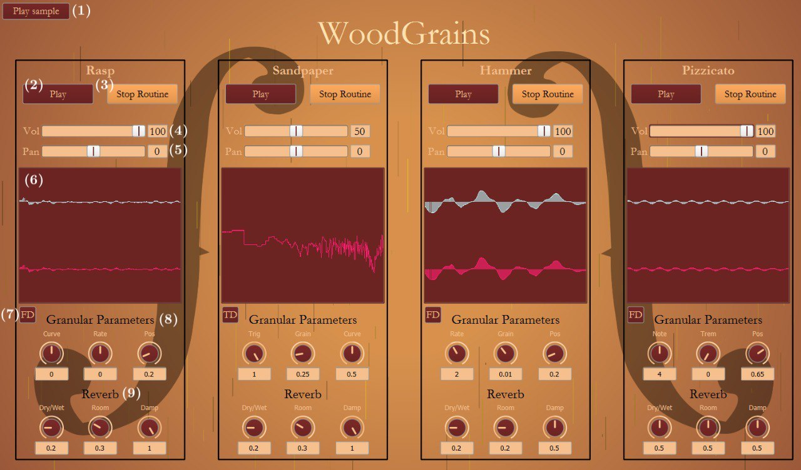

# WoodGrains

<em> Group 10 - AKGigi </em>

## General informations
WoodGrains is a project we developed using SuperCollider for homework #1 of Computer Music Languages and Systems. The main task of the project was to recreate foley sounds of the luthier's lab by means of granular synthesis. We use GrainBuf class to perform this process. The source track used for the implementation of the granular synthesis is the famous Cello Suite No. 1 in G Major by J. S. Bach.

___

## Folder structure
In the GitHub repository you will find four folders: 

1. font
2. images
3. sample
4. src

In the font folder there is the fonts used in the GUI. If they are not present in your OS, please install them.

In the src folder you will find the SuperCollider code.

___

## GUI instructions

In the image below, you can see the GUI of our project.

  

In the top-left of the window it is possible to find a button (1) that reproduces the source track. The rest of GUI is divided in four boxes, one for each of the implemented sound. They are all structured in the same way, as follow. In the top there are two buttons, the first one (2) allows to play the single foley sound and the second one (3) starts a loop in which the sound is repeated until it is clicked a second time. Immediately under them, there are two sliders to control volume (4) and pan (5), respectively. The square in the centre of the column (6) is the temporal plot of the sound of the left and the right channel. With the button (7) the user can change the plot domain into frequency. Finally, in the bottom part it is possible to find two rows of knobs. In the first row (8) the user can change some of the parameters of the granular synthesis and of the envelope, depending on the sound. In particular, from left to right, for the  
- <b>Rasp</b>: the curve coefficient of the envelope, rate and pos.  
- <b>Sandpaper</b>: the trigger frequency, the duration of the grain and the curve coefficient of the
envelope. 
- <b>Hammer</b>: rate, the duration of the grain and pos. 
- <b>Pizzicato</b>: the note, the frequency of the tremolo and pos.

___

## Notes

Please use your headphones for an enhanced experience.  
For more detailed informations, please check the [report](https://github.com/polimi-cmls-22/group10-hw-SC-AKGigi/blob/main/Report_WoodGrains.pdf) we wrote.

___

## Group Components

- Riccardo Alfieri (riccardo.alfieri@mail.polimi.it)
- Riccardo Iaccarino (riccardo.iaccarino@mail.polimi.it)
- Manuele Montrasio (manuele.montrasio@mail.polimi.it)
- Silvio Sgotto (silvio.sgotto@mail.polimi.it)
- Francesco Veronesi (francesco.veronesi@mail.polimi.it)